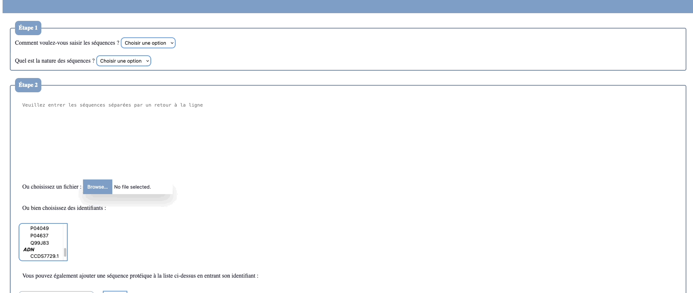
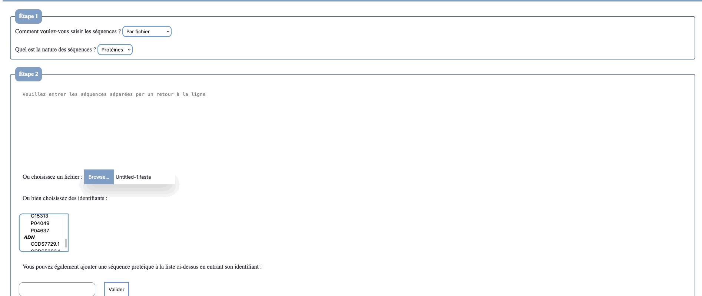
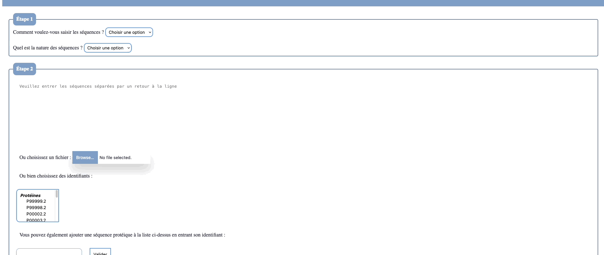
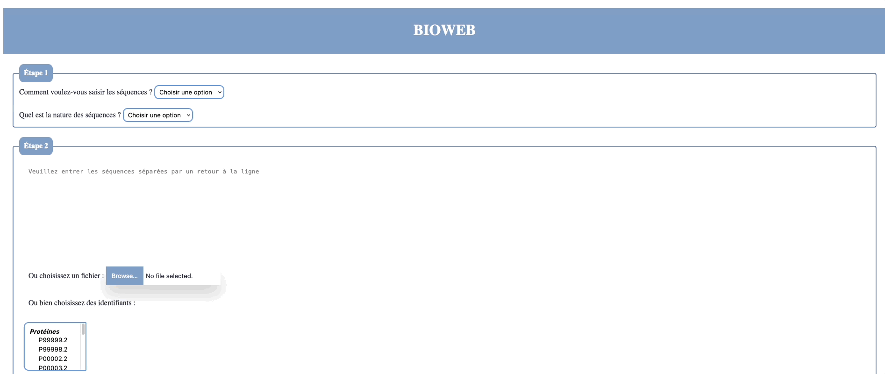

###BioWeb 
Cette application web réalise, les alignements global et multiple entre 2 et plus séquences de protéines ou d'ADN. Dans le cas des alignements multiples il est également possible de générer le weblogo. Il est possible de rentrer les séquences par saisie manuelle, séléction dans la base de données ou fichier. Il est possible d'ajouter des séquences dans la base de données grâce à leur identifiant.

## Alignement global séquences protéiques
 

## Alignement multiple séquences nucléotidiques

## Ajout de séquences dans la base de données

## Weblogo de l'alignement multiple de 5 séquences protéiques 

## Weblogo de l'alignement de séquences d'ADN 

